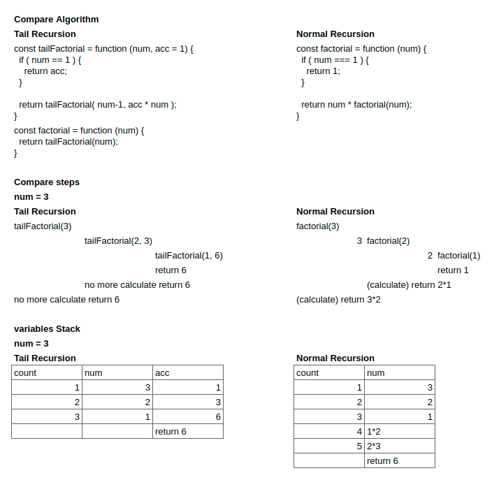

# Hello Coding

## Chapter 3

Date: 200817

Roles: let todaysRole = null; // didn't record it...

Contents:

1. 코딩공유시간

   - 폴님: 두 값을 스왑하기 위해 변수 tmp를 선언하는 게 중요 포인트였다
   - 하정님, 현진님: 첫번째 for문 ( i < length -1 ) 에서 맨 마지막 요소는 굳이 비교해줄 필요가 없었다
   - 시영님: arraySwap() 함수를 통해서 배열과 스왑하고자하는 요소의 인덱스를 입력받아 변경해주도록 하였다. 함수 init()을 선언해서, 코드를 이해하기 쉽게 구조화하였다.

2. 개념공유시간

   - 규하님: 꼬리 재귀 예시
   - 폴님: 스택에 대해 설명. 동전탑에서 탑이 무너지지않게 동전을 빼려면 맨 아래의 것을 뺄 수 없다. first in last out.
   - 시영님: invoke (호출) 에 대한 이야기. 함수는 맨 마지막에 몰려서 실행된다는 게 같은 개념인가? ( 네, 비슷합니다. ) 토이프로젝트 형식으로 재귀를 어떻게 할 수 있을까? 구현단계에서 너무 힘들어 지겠다 싶어서 멈췄다.
   - 하정님: 신기했던 거 공유. 스택 오버플로우의 비하인드를 들은 거 같아서 신기하고 재밌었다.

3. 책의 연습문제에 대한 공유

   - 하정님: 오늘 연습문제는 생각을 정리하는 것에 가까운 내용이었다.
   - 시영님: 책의 예제 greet 함수를 준비해왔다! 예시에서 greet은 고차함수인가? --> no. 외부의 함수를 실행할 뿐이다.
   - 폴님: JS를 배우고 나니 파이썬의 코드도 어렵지않게 이해가 되었다. 코드를 짜고 실행함에 있어서 구획을 나눠서 하면 좀 더 코드를 이해하기 쉽다.
     base case는 완료문, recursive case 재귀문

4. 배운 개념 토대로 수도코드 작성 ( pseudo code )

- 코플릿 17번 풀어보기

5. Tail Recursion Example ( 꼬리 재귀 예시 )

