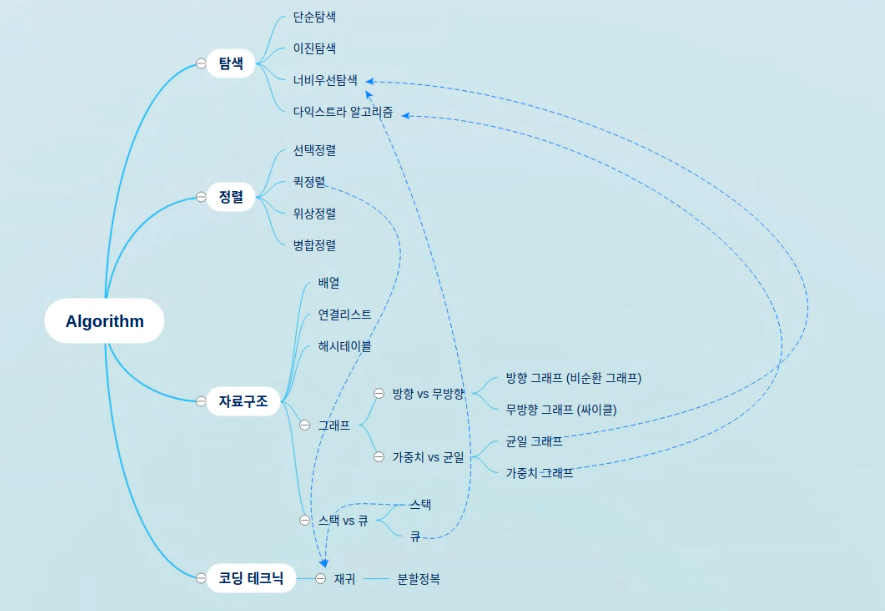

# Hello Coding

## Chapter 3

Date: 200812

Roles: let todaysRole = null; // didn't record it...

Contents:

1. 숙제없음

2. 개념공유시간

   - 하정님: 해탈의 경지에 올랐는지 이해가 되지 않는다. 근사 알고리즘 안에 탐욕 알고리즘이 있는건가? NP문제는 근사 알고리즘을 쓰는 건가 탐욕 알고리즘을 쓰는 건가 무엇이 NP인가 무엇이 탐욕인가 무엇이 근사인가. 그래서 제가 이걸 공유할 수 있을까요....
   
   이때까지 이렇게 정료해봤는데, 근사 알고리즘과 탐욕 알고리즘은 어디에 위치해야 하는가...  관계를 잘못짜고 있나? 이해를 잘못한 건가? 헷갈림.
     - 시영님: 이건 좀 다른 문제인 거 같아영
     - 폴님: 저도 헷갈려여

      그럼 근사 알고리즘의 하위 요소로 탐욕 알고리즘이 있는 건가요?
      - 시영님: 하나하나의 경우의 수를 따지기 보다 근사한 느낌이면 이걸로 가자! 이게 최선이라고 생각하자! 이게 탐욕 알고리즘인 거 같아여
      - 폴님: 알고리즘은 최선을 찾아야 하는데 이건 약간 차선을 찾는 느낌이에여
      - 시영님: 단순 알고리즘은 최적의 케이스가 정해져 있었는 데 탐욕 알고리즘은 케이스가 너무 많다보니까 근사 알고리즘으로 해결하는 게 아니냐
      - 규하님: 그림 1에 없어서 새로운 그림을 그리셔야 돼여
      - 시영님: NP 완전 문제를 다루는 방법을 다루는 방법에 대해 알려주고 근사, 탐욕 알고리즘을 설명해주면 얼마나 좋았을까... 생각함
   - 폴님: 책의 도둑 문제를 코드로 구현하였다. 리팩토링 중이라 아직 안돌아감. 로직은 굿굿.
     - 시영님: 오늘은 폴님이 MVP네요
   - 시영님: 책에는 근사 알고리즘의 최선의 방법을 파악하는 방법이 정확하게 정리가 돼있다. 아마도 동적 프로그래밍을 보면 이해가 되지 않을까 한다. x의 모든 조합이라고 하면 보통 NP 완전 문제다 라고 하는 게 라디오 예시를 직접해봤는데 생각보다 쉽지 않더라. 조합이 있으면 대게 NP완전문제이지 않을까 생각한다. 이런 NP 완전문제면 탐욕알고리즘을 쓰라고 이해했다. 연습문제에서 3, 4, 5가 헷갈렸다.

3. 책의 연습문제에 대한 공유

   - 시영님: 1번과 2번은 단순해서 논할 가치가 없다고 생각한다. 그럼에도 불구하고 화면을 공유하면서 같이 한 번 풀어보겠다. 1번 문제는 실제 세상에 대입해보면 되게 시야를 새롭게 만들어 주는 거 같다. 2번은 결국 가장 가고 싶은 곳을 고르고, 그곳에서 가까운 곳으로 계획을 짜는 게 맞다고 생각한다. 만약 1순위로 갔는데, 근처에 가고 싶은 곳이 없는 경우 최악의 경우가 되지 않을까?
     - 폴님: 여행시간을 줄이는 게 시영님의 목표라는 거군요
   - 폴님: 퀵 정렬은 탐욕 알고리즘과 개념이 완전히 다르다고 생각한다.
     - 시영님: 동의

      그렇지만 퀵 정렬은 탐욕 알고리즘이라고 생각한다.

       - 시영님: 아무 숫자나 랜덤하게 고르는 거니까 이게 최선이었지 않을까? --> 답을 보고 나니, 이건 우리가 해야할 게 정해져 있으니 O(NlgN) 이니까 탐욕이 아닌건가? 라고 생각했다

     너비 우선 탐색은 탐욕 알고리즘이 아니다. 반면에 다익스트라는 주위에 있는 것 중에 가장 작은 cost를 가지고 있는 곳을 찾는 방법이기 때문에 탐욕 알고리즘이다.
   - 하정님: 저는 탐욕 알고리즘 자체를 잘 이해 못했다. 지금의 각 단계에서 최적을 찾고, 그게 전체의 최적을 발견하는 걸로 이해해서 재귀랑 혼동이 온다. 퀵 정렬도 재귀고, 이것도 재귀고 --> 혼돈의 카오스.

     - 시영님 : 답을 보고 생각을 정리해봤다. 퀵정렬의 경우 방법이 정해져있다. 퀵정렬은 재귀적 사고가 가능할 것이다. 너비우선과 다익스트라는 경우의 수가 많지 않으면 복잡해 보이지 않겠지만 수가 커지면 복잡해진다. 그렇기 때문에 재귀적 사고가 힘들지 않을까. 그러니 탐욕 알고리즘일 것이다.
   - 규하님: 혼동하고 있는 개념 정리. 재귀 : 하스켈 언어는 반복문이 없어서 반복문처럼 활동을 하기 위해 재귀를 사용. 반복문과 재귀는 문제를 풀어내는 방법. 재귀적 사고가 가능한가는 의미가 없음. 반복문으로 해결이 가능하면 재귀도 가능. 재귀적 사고가 들어오는 것은 재귀에 대한 이해가 필요한 것. 퀵정렬같은 경우, 개수가 정해져있고 알고리즘의 상한이 명확 <- 탐욕알고리즘이 아님. 너비우선탐색, 다익스트라 알고리즘의 경우. 한칸씩 가면서 개수를 1씩 넓히면서 최적을 찾는 것. 둘 사이의 거리가 엄청 멀다면 경우의 수가 기하급수로 늘어남.미로를 그려보면 이해하기 쉬움. 각 구역별로 최선의 선택을 반복하기 때문에 전 구역에서 최선의 선택이 되는 것. 탐욕 알고리즘은 짜기 쉽다. (조건이 하나뿐. 항상 적은 값을 고르려고 한다. 최선의 값을 고르려고 한다.) : 코드가 더러워질 필요가 없고 하나 정도만 걸러주면 된다. 다익스트라 알고리즘은 마찬가지 내용
     - 폴님 : 그러면! NP 완전문제는 최선의 선택을 많이 하는 경우가 NP인가?
     - 규하님: n차항. 다항식으로 나타낼 수 있느냐? 이 형태로 모형화가 가능하면 NP가 아님. NP형은 지수형. 차수로 나누기 힘든 애들.